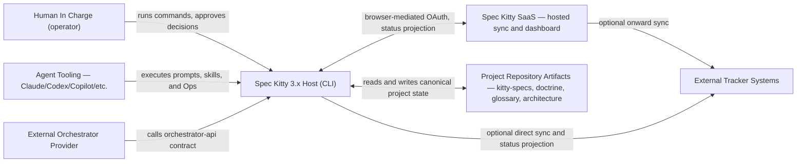
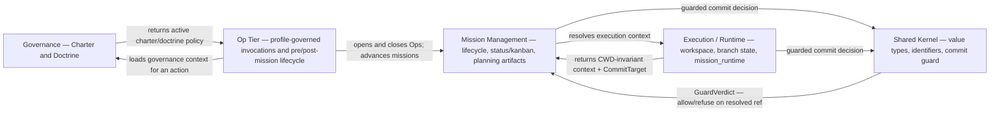

# 3.x System Context

| Field | Value |
|---|---|
| Status | Living |
| Date | 2026-06-11 |
| Scope | C4 Level 1 system boundary and external interactions (3.x) |
| Related ADRs | `2026-06-03-1`, `2026-06-03-2`, `2026-06-03-3`, `2026-06-07-1`, `2026-04-09-1`, `2026-04-09-2` |

## Purpose

Clarify where Spec Kitty 3.x starts and ends, who interacts with it, and which
boundaries must remain explicit for safe operation.

## Scope Rules

1. Focus on actors, external systems, and authority boundaries.
2. Capture why interactions exist and what constraints apply.
3. Defer internal module detail to [`../02_containers/README.md`](../02_containers/README.md)
   and [`../03_components/README.md`](../03_components/README.md).

## Primary Audience

| Audience | Why This View Matters |
|---|---|
| [Project Owner](../../../context/audience/external/project-owner.md) | Understands accountability and approval boundaries. |
| [System Architect](../../../context/audience/internal/system-architect.md) | Validates integration and authority contracts. |
| [AI Collaboration Agent](../../../context/audience/internal/ai-collaboration-agent.md) | Aligns execution behavior with host-owned constraints. |
| [Spec Kitty CLI Runtime](../../../context/audience/internal/spec-kitty-cli-runtime.md) | Enforces command and state authority boundaries. |

## Context Diagram (Mermaid)

## External Interaction Contracts

| External Entity | Interaction Contract | Boundary Rule |
|---|---|---|
| Human In Charge | Command invocation and approval checkpoints | Final acceptance authority stays human-owned. |
| Agent Tooling | Prompt-, skill-, and Op-driven workflow execution | Agents execute within host constraints and the resolved profile's governance scope. |
| External Orchestrator Provider | Orchestrator API calls | Provider is adapter-only; host remains lifecycle authority. |
| Spec Kitty SaaS | Browser-mediated OAuth auth + hosted status projection | Auth is browser-OAuth, not password (`2026-04-09-2`); the host remains the canonical state authority. |
| External Tracker Systems | Status/event projection | Tracker sync is optional and discovered, not user-supplied (`2026-04-04-1`). |
| Project Repository Artifacts | Filesystem state read/write | Repository artifacts are canonical persistent state. |

## Domain Context Map

The 3.x system is organized into **four bounded modules** that communicate only
through Open Host Service (OHS) facades
([`../../3.x/adr/2026-06-03-1-execution-state-domain-model.md`](../../../adr/3.x/2026-06-03-1-execution-state-domain-model.md)).

| Domain | Context-Level Boundary Statement |
|---|---|
| Governance | Charter and Doctrine define what the project may do and how; they are policy inputs, never bypass mission sequencing. |
| Mission Management | Owns mission lifecycle, WP status/kanban, status events, and planning artifacts; the **sole** status authority. |
| Execution / Runtime | Owns workspace resolution, branch state, and the CWD-invariant `mission_runtime` execution context. |
| Shared Kernel | Provides value types and the single commit-guard decision; holds no domain logic. |
| Op Tier | The shared Op shape across `spec-kitty dispatch` and pre/post-mission lifecycle; governed by a resolved agent profile. |

## Branch and Routing Boundary

1. Mission metadata (`meta.json`) carries canonical mission identity (`mission_id`)
   and target-line intent used for lifecycle routing (`2026-04-09-1`).
2. A single resolved [`CommitTarget(ref, kind)`](../../../adr/3.x/2026-06-03-2-executioncontext-owner-and-committarget.md)
   is the one destination both planning artifacts and status events resolve to.
3. Worktree invocation does not transfer canonical lifecycle authority; the
   resolved context is CWD-invariant.
4. The single commit-guard decision authorizes or refuses a commit on that
   resolved ref — pushing to `origin/main` is outside the guard's reach entirely.

## Boundary and Trade-off Notes

1. Host-owned authority is intentional: orchestration and SaaS are pluggable,
   state-mutation authority is not.
2. External integrations are optional by design to preserve local-first operation.
3. The model favors traceability and deterministic behavior over implicit
   automation shortcuts.

## Decision Traceability

<!-- DECISION: 2026-06-03-1 - Four bounded modules, OHS facades only -->
<!-- DECISION: 2026-06-07-1 - mission_runtime is the canonical execution-state surface -->
<!-- DECISION: 2026-06-03-2 - One CommitTarget(ref, kind) destination for artifacts and status -->

## Traceability

- Domain model ADR: [`../../3.x/adr/2026-06-03-1-execution-state-domain-model.md`](../../../adr/3.x/2026-06-03-1-execution-state-domain-model.md)
- Canonical execution surface ADR: [`../../3.x/adr/2026-06-07-1-execution-state-canonical-surface.md`](../../../adr/3.x/2026-06-07-1-execution-state-canonical-surface.md)
- ExecutionContext owner + CommitTarget ADR (incl. 2026-06-10 addendum): [`../../3.x/adr/2026-06-03-2-executioncontext-owner-and-committarget.md`](../../../adr/3.x/2026-06-03-2-executioncontext-owner-and-committarget.md)
- Container view: [`../02_containers/README.md`](../02_containers/README.md)
- Component view: [`../03_components/README.md`](../03_components/README.md)
