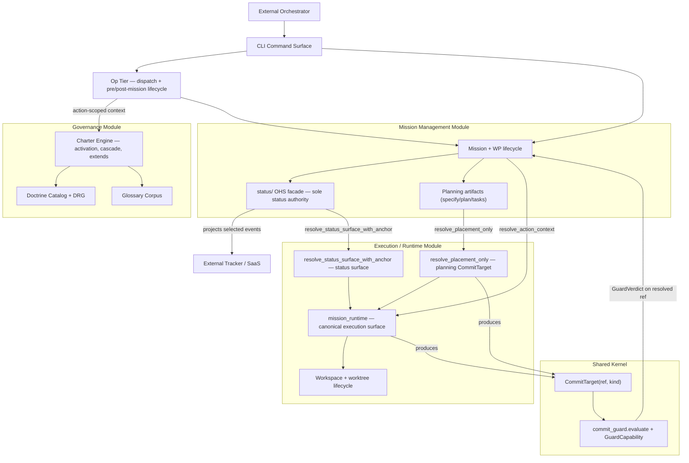

# 3.x Containers

| Field | Value |
|---|---|
| Status | Living |
| Date | 2026-06-11 |
| Scope | C4 Level 2 container model (3.x) — four bounded modules + Op tier |
| Related ADRs | `2026-06-03-1`, `2026-06-03-2`, `2026-06-03-3`, `2026-06-07-1`, `2026-04-25-1`, `2026-05-16-1` |

## Purpose

Show the major logical containers in Spec Kitty 3.x and define how they
collaborate to enforce governance, mission lifecycle, execution-state
resolution, and the single commit-protection decision.

## Scope Rules

1. Use stable logical container boundaries (the four bounded modules), not
   implementation package inventories.
2. Focus on contracts, responsibilities, and behavior loops.
3. Defer intra-module component detail to [`../03_components/README.md`](../03_components/README.md).
4. Use [`runtime-execution-domain.md`](runtime-execution-domain.md) for the
   deeper lifecycle/routing/FSM detail that would overload the top-level map.

## Container Diagram (Mermaid)

The four bounded modules are the top-level containers. They communicate through
**Open Host Service (OHS) facades** only
([`../../3.x/adr/2026-06-03-1-execution-state-domain-model.md`](../../../adr/3.x/2026-06-03-1-execution-state-domain-model.md)).

## Container Responsibilities

| Container | Core Responsibility | Behavioral Ownership |
|---|---|---|
| CLI Command Surface | Interactive and scripted command entry point | Validates command intent and routes to the Op tier and bounded modules |
| Op Tier | Standalone dispatch invocations and the pre/post-mission lifecycle | Opens an Op under resolved governance context, does the work, closes the Op with the real outcome |
| Charter Engine | Charter interview, activation, cascade, and `org-charter.yaml` `extends:` resolution | Produces governance constraints (the active charter/doctrine policy) consumed by the Op tier and missions |
| Doctrine Catalog + DRG | Typed governance/mission assets and the Doctrine Relationship Graph | Loads/validates doctrine resources; resolves profile lineage via DRG edges |
| Glossary Corpus | Canonical terminology surface | Supplies terms and guards terminology drift |
| Mission + WP lifecycle | Mission and work-package lifecycle precedence | Owns lifecycle sequencing; delegates execution-state resolution to `mission_runtime` |
| `status/` OHS facade | Canonical lifecycle and event semantics | **Sole** status authority — no module outside Mission Management imports `status` internals |
| Planning artifacts | specify / plan / tasks / finalize-tasks outputs | Commits planning artifacts to the resolved `CommitTarget` |
| `mission_runtime` | Canonical execution-state surface | Resolves CWD-invariant `ExecutionContext` and the single `CommitTarget`; consumers import only from the package root |
| `resolve_placement_only` | WP-less planning-phase projection | One narrow entry point over the same resolution authority — the planning `CommitTarget` |
| `resolve_status_surface_with_anchor` | Single-pass status-surface + primary-anchor resolution | The one status-surface authority; fails closed rather than handing back a primary surface (kills the split-brain class) |
| `CommitTarget(ref, kind)` | The one ref artifacts and status events resolve to | Self-validating value object pairing the destination `ref` with its topology `kind` |
| `commit_guard.evaluate` + `GuardCapability` | The ONE commit-protection decision | Pure function: echoes `CommitTarget.ref` as the resolved destination; capability is asserted at the call site, never derived |

## Canonical-shape notes (3.x — what these containers are NOT)

- The execution-state surface is the top-level `mission_runtime` package. The
  retired `specify_cli/core/execution_context.py` home is **gone** and is
  deliberately not depicted (`2026-04-25-1`, `2026-06-07-1`).
- `CommitTarget` is `(ref, kind)` — a destination ref paired with its topology
  classification. The earlier sketch of `(worktree_root, destination_ref)` is
  superseded and **not** depicted (see the 2026-06-10 addendum to
  [`../../3.x/adr/2026-06-03-2-executioncontext-owner-and-committarget.md`](../../../adr/3.x/2026-06-03-2-executioncontext-owner-and-committarget.md)).
- Commit protection is one pure decision (`commit_guard.evaluate`) parameterized
  by an explicit `GuardCapability`; the five legacy privilege channels were
  folded into that capability and are not depicted.

## Domain-to-Container Allocation

| Domain (bounded module) | Primary Containers | Secondary Containers |
|---|---|---|
| Governance | Charter Engine, Doctrine Catalog + DRG, Glossary Corpus | CLI Command Surface, Op Tier |
| Mission Management | Mission + WP lifecycle, `status/` OHS facade, Planning artifacts | CLI Command Surface |
| Execution / Runtime | `mission_runtime`, `resolve_placement_only`, `resolve_status_surface_with_anchor`, Workspace lifecycle | Mission + WP lifecycle |
| Shared Kernel | `CommitTarget(ref, kind)`, `commit_guard.evaluate` + `GuardCapability` | — |
| Op Tier (cross-module) | Op Tier | Charter Engine, Mission + WP lifecycle |

## Behavioral Collaboration Loops

### Loop A: Mission lifecycle and execution-state resolution

1. CLI captures the command and routes it to the Op tier / Mission Management.
2. Mission Management calls `resolve_action_context` on `mission_runtime` to get
   a CWD-invariant `ExecutionContext` and the single `CommitTarget`.
3. Lifecycle mutation commands execute through the `status/` OHS facade.
4. The facade validates transitions, appends events, and materializes snapshots.

### Loop B: Single-destination commit protection

1. `mission_runtime` (or the planning-phase `resolve_placement_only`) produces
   one `CommitTarget(ref, kind)`.
2. `commit_guard.evaluate` decides — purely, from the target plus an asserted
   `GuardCapability` — whether the commit may land on that ref.
3. The verdict echoes `CommitTarget.ref` as the resolved destination; the guard
   never re-derives a destination and never performs a push.

### Loop C: Governance-context-scoped Ops

1. The Op tier asks the Charter Engine for the action-scoped governance context.
2. The Charter Engine resolves the active charter/doctrine (including
   `org-charter.yaml` `extends:` and DRG profile lineage).
3. The Op runs under that context and is closed with its real outcome.

## Runtime/Execution Domain Detail

See [Runtime/Execution Domain (Container Detail)](runtime-execution-domain.md)
for the canonical work-package lifecycle FSM, transition-guard summary, and
execution/routing invariants.

## Interaction Constraints

1. State transitions are host-authoritative; orchestrator, SaaS, and trackers use
   contract surfaces only.
2. Modules communicate through OHS facades; `status` internals are import-forbidden
   outside Mission Management.
3. There is exactly one execution-state surface (`mission_runtime`) and one
   commit-protection decision (`commit_guard.evaluate`).
4. Tracker/SaaS integrations are optional and boundary-scoped.

## Decision Traceability

<!-- DECISION: 2026-06-03-1 - Four bounded modules; status owned exclusively by Mission Management -->
<!-- DECISION: 2026-06-07-1 - mission_runtime is the canonical execution-state surface -->
<!-- DECISION: 2026-06-03-2 - CommitTarget(ref, kind) is the one destination; GuardCapability asserts authorization -->

## Traceability

- Domain model ADR: [`../../3.x/adr/2026-06-03-1-execution-state-domain-model.md`](../../../adr/3.x/2026-06-03-1-execution-state-domain-model.md)
- Canonical execution surface ADR: [`../../3.x/adr/2026-06-07-1-execution-state-canonical-surface.md`](../../../adr/3.x/2026-06-07-1-execution-state-canonical-surface.md)
- ExecutionContext owner + CommitTarget ADR (incl. 2026-06-10 addendum): [`../../3.x/adr/2026-06-03-2-executioncontext-owner-and-committarget.md`](../../../adr/3.x/2026-06-03-2-executioncontext-owner-and-committarget.md)
- Shared package boundary ADR: [`../../3.x/adr/2026-04-25-1-shared-package-boundary.md`](../../../adr/3.x/2026-04-25-1-shared-package-boundary.md)
- Runtime/execution detail: [`runtime-execution-domain.md`](runtime-execution-domain.md)
- Context view: [`../01_context/README.md`](../01_context/README.md)
- Component view: [`../03_components/README.md`](../03_components/README.md)
