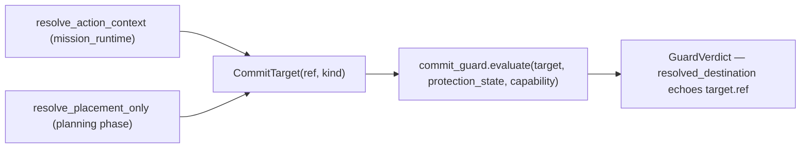
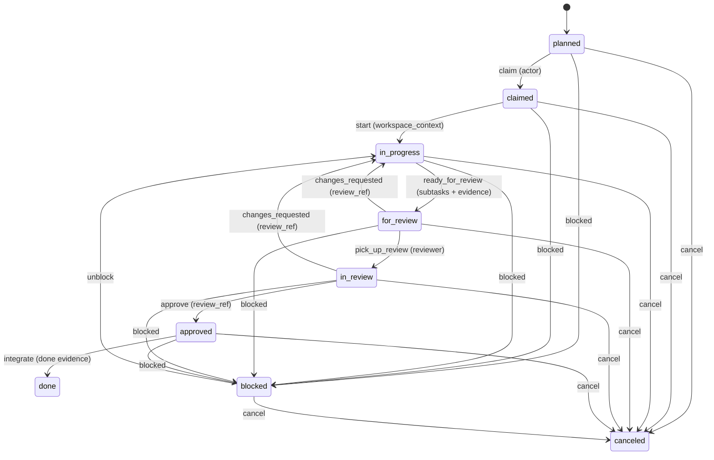
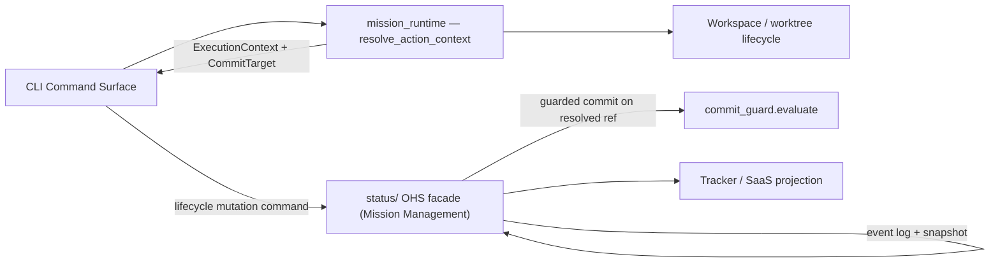

# 3.x Runtime/Execution Domain (Container Detail)

| Field | Value |
|---|---|
| Status | Living |
| Date | 2026-06-11 |
| Scope | Container-level execution-state resolution, routing, and the canonical WP lifecycle FSM (3.x) |
| Related ADRs | `2026-06-03-1`, `2026-06-03-2`, `2026-06-07-1`, `2026-04-06-1`, `2026-05-01-1` |

## Purpose

Provide a focused container-level view of the Execution / Runtime module:
execution-state resolution, the single commit destination, branch-target
routing, and the canonical work-package lifecycle FSM.

## Domain Boundary (Container Level)

| Concern | Primary Containers | Outcome |
|---|---|---|
| Execution-state resolution | `mission_runtime` (`resolve_action_context`), Workspace lifecycle | CWD-invariant `ExecutionContext` + single `CommitTarget` |
| Planning-phase placement | `resolve_placement_only` | The WP-less planning `CommitTarget` from the same authority |
| Status-surface resolution | `resolve_status_surface_with_anchor` | Single-pass status surface + primary anchor (fails closed) |
| Lifecycle mutation | `status/` OHS facade (Mission Management) | Guarded transition validation and event-sourced persistence |
| Commit protection | `commit_guard.evaluate` + `GuardCapability` (Shared Kernel) | The one allow/refuse decision on the resolved ref |

## Runtime/Execution Invariants

1. There is exactly one execution-state surface: the top-level `mission_runtime`
   package. The retired `specify_cli/core/execution_context.py` home is gone.
2. `resolve_action_context` is CWD-invariant, topology-aware, and mode-correct;
   it raises rather than silently falling back on unresolvable context.
3. `target_branch` is resolved **exactly once** per operation and threaded onto
   the context; no downstream surface re-derives it.
4. `mid8` is derived **exactly once** as `mission_id[:8]`.
5. Lifecycle authority remains host-owned even when projection is enabled.

## Single Commit Destination (CommitTarget)

- `CommitTarget` is `(ref, kind)`: a destination `ref` paired with its topology
  `kind` — `PRIMARY`, `COORDINATION`, or `FLATTENED`. (It is NOT the earlier
  `(worktree_root, destination_ref)` sketch — see the 2026-06-10 addendum to ADR
  [`../../3.x/adr/2026-06-03-2-executioncontext-owner-and-committarget.md`](../../../adr/3.x/2026-06-03-2-executioncontext-owner-and-committarget.md).)
- `resolve_placement_only` is a narrower entry point over the **same** resolution
  authority as `resolve_action_context` — the topology classification is
  byte-identical for the same mission, not a parallel resolver.
- `commit_guard.evaluate` is pure: it echoes `target.ref` as the resolved
  destination and never re-derives one. `GuardCapability` (`STANDARD` by
  default) is asserted at the call site, never derived from message text, file
  content, env, or op records. No capability can authorize a push to
  `origin/main` — the guard only ever commits locally.

## Branch Target Routing Invariants

1. Mission metadata (`meta.json`) carries canonical identity (`mission_id`) and
   the routing authority (`target_branch`).
2. Lifecycle/status commits route to the resolved `CommitTarget.ref`, not the
   caller's location.
3. Worktree context does not reassign lifecycle authority; the resolved context
   is CWD-invariant.
4. When a mission declares `coordination_branch`, the status surface is composed
   once for the coordination root; a materialized coord root lacking the mission
   dir fails closed rather than falling back to a primary surface.

## Canonical Work Package Lifecycle FSM

The lane state is owned by an append-only event log and reduced to a snapshot;
lane behavior is modeled with the State pattern (`2026-04-06-1`). `doing` is an
input alias for `in_progress` and is never persisted.

## Transition Guard Summary

1. Canonical lanes: `planned`, `claimed`, `in_progress`, `for_review`,
   `in_review`, `approved`, `done`, `blocked`, `canceled`.
2. `blocked` is reachable from every non-terminal lane; `canceled` is reachable
   from all.
3. `done` and `canceled` are terminal (a force override is required to leave).
4. `doing` is an input alias for `in_progress`, resolved at input boundaries and
   never persisted.
5. Guard requirements are transition-specific: `actor`, workspace context,
   `review_ref`, done evidence, and explicit reason fields.
6. Dependency gating: a WP with `dependencies` cannot be claimed/implemented until
   every dependency is `approved` or `done`.

## Runtime/Execution Container Interaction

## Traceability

- Domain model ADR: [`../../3.x/adr/2026-06-03-1-execution-state-domain-model.md`](../../../adr/3.x/2026-06-03-1-execution-state-domain-model.md)
- Canonical execution surface ADR: [`../../3.x/adr/2026-06-07-1-execution-state-canonical-surface.md`](../../../adr/3.x/2026-06-07-1-execution-state-canonical-surface.md)
- WP State pattern ADR: [`../../3.x/adr/2026-04-06-1-wp-state-pattern-for-lane-behavior.md`](../../../adr/3.x/2026-04-06-1-wp-state-pattern-for-lane-behavior.md)
- Container map: [`README.md`](README.md)
- Component model: [`../03_components/README.md`](../03_components/README.md)
