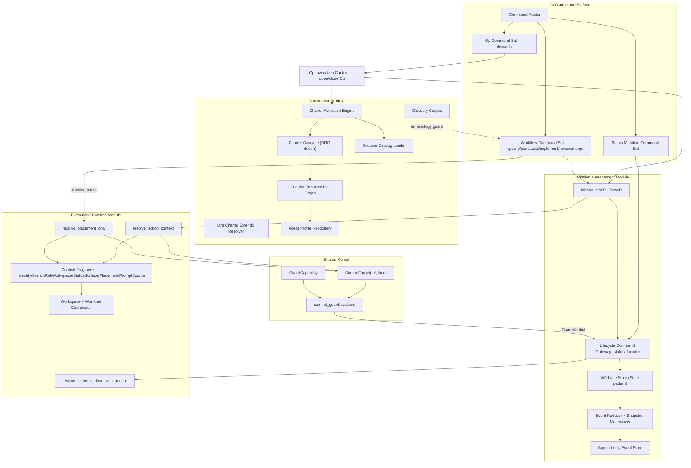
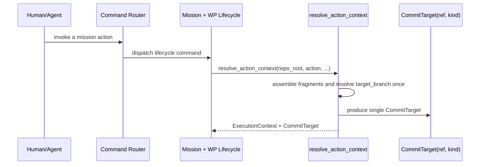
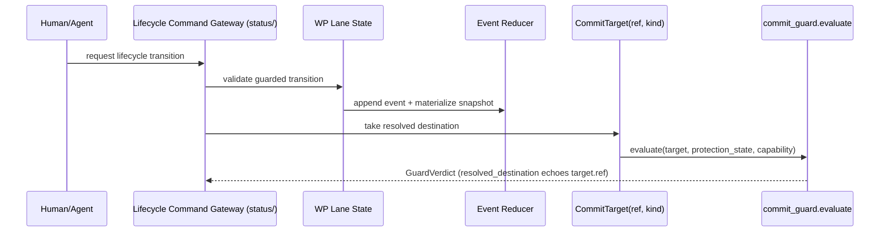
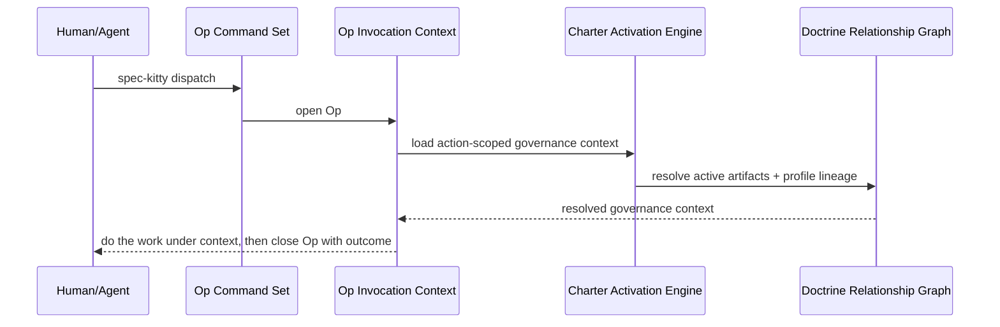
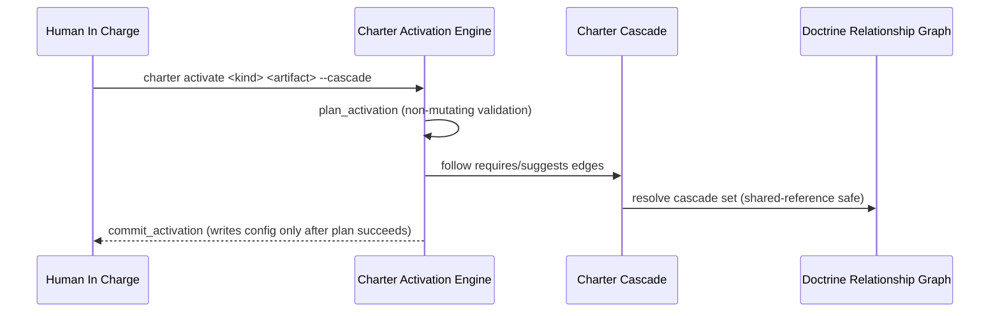
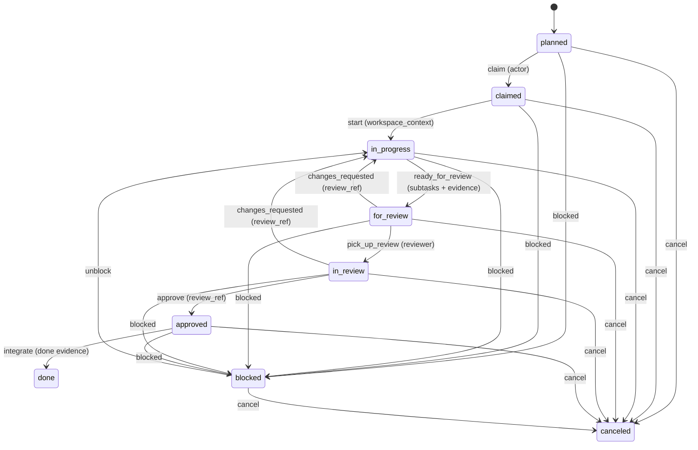

# 3.x Components

| Field | Value |
|---|---|
| Status | Living |
| Date | 2026-06-11 |
| Scope | C4 Level 3 logical component view (3.x) |
| Related ADRs | `2026-06-03-1`, `2026-06-03-2`, `2026-06-03-3`, `2026-06-07-1`, `2026-04-06-1`, `2026-05-16-1` |

## Purpose

Define component-level boundaries for Spec Kitty 3.x while remaining
implementation-agnostic and behavior-focused, aligned to the four bounded
modules and the Op tier.

## Scope Rules

1. Focus on conceptual components and contracts, not file/class listings.
2. Explain behavior and interaction patterns that matter architecturally.
3. Keep component definitions aligned with the container boundaries and 3.x ADRs.

## Component Diagram (Mermaid)

## Component Responsibility Map

| Component | Module | Responsibility |
|---|---|---|
| Command Router | CLI | Normalizes and dispatches commands to the correct surface |
| Workflow Command Set | CLI | Drives specify/plan/tasks/implement/review/merge command families |
| Status Mutation Command Set | CLI | Handles lane-transition and status-mutation commands |
| Op Command Set | CLI | Handles `spec-kitty dispatch` governed invocations |
| Op Invocation Context | Op Tier | Opens an Op under resolved governance context and closes it with the real outcome |
| Charter Activation Engine | Governance | Plan/commit activation seam; writes config only after plan succeeds |
| Charter Cascade | Governance | Follows DRG `requires`/`suggests` edges for cascade (de)activation |
| Org Charter Extends Resolver | Governance | Canonical `org-charter.yaml extends:` chain resolver (`charter.org_extends`): base-first order, fail-closed on cycles/missing bases; the legacy loader delegates here |
| Doctrine Catalog Loader | Governance | Loads doctrine assets as typed artifacts; surfaces load diagnostics |
| Doctrine Relationship Graph | Governance | Generated edge graph; resolves profile lineage (`specializes_from`) |
| Agent Profile Repository | Governance | Resolves agent profiles via DRG traversal |
| Glossary Corpus | Governance | Canonical terminology surface and drift guard |
| Mission + WP Lifecycle | Mission Mgmt | Owns mission/WP lifecycle precedence and dependency gating |
| Lifecycle Command Gateway | Mission Mgmt | The `status/` OHS facade — normalizes lifecycle mutation requests |
| Event Reducer + Snapshot Materializer | Mission Mgmt | Deterministically reduces the event log to a snapshot |
| Append-only Event Store | Mission Mgmt | JSONL event I/O with corruption detection — sole lane authority |
| WP Lane State (State pattern) | Mission Mgmt | Models lane behavior per the State pattern (`2026-04-06-1`) |
| `resolve_action_context` | Execution | Resolves CWD-invariant `ExecutionContext` + single `CommitTarget` |
| `resolve_placement_only` | Execution | WP-less planning projection over the same resolution authority |
| `resolve_status_surface_with_anchor` | Execution | Single-pass status surface + primary anchor; fails closed |
| Context Fragments | Execution | Cohesive value-object fragments composed per operation (op-composite) |
| Workspace + Worktree Coordinator | Execution | Resolves/reuses the execution workspace |
| `CommitTarget(ref, kind)` | Shared Kernel | The one destination ref + topology kind for artifacts and status |
| `commit_guard.evaluate` | Shared Kernel | The ONE commit-protection decision (pure; echoes `target.ref`) |
| `GuardCapability` | Shared Kernel | Asserted-at-the-surface authorization parameter to `evaluate` |

## Canonical-shape notes (3.x)

- Execution-state resolution lives in `mission_runtime`; consumers import only
  from the package root. The retired `core/execution_context.py` home is gone
  and is not depicted (`2026-04-25-1`, `2026-06-07-1`).
- `CommitTarget` is `(ref, kind)`, not `(worktree_root, destination_ref)` — see
  the 2026-06-10 addendum to ADR
  [`../../3.x/adr/2026-06-03-2-executioncontext-owner-and-committarget.md`](../../../adr/3.x/2026-06-03-2-executioncontext-owner-and-committarget.md).
- Authorization is one explicit `GuardCapability` argument; the five legacy
  privilege channels were folded in and are not depicted.

## Domain Alignment Matrix

| Domain (bounded module) | Primary Components |
|---|---|
| Governance | `Charter Activation Engine`, `Charter Cascade`, `Org Charter Extends Resolver`, `Doctrine Catalog Loader`, `Doctrine Relationship Graph`, `Agent Profile Repository`, `Glossary Corpus` |
| Mission Management | `Mission + WP Lifecycle`, `Lifecycle Command Gateway`, `Event Reducer + Snapshot Materializer`, `Append-only Event Store`, `WP Lane State` |
| Execution / Runtime | `resolve_action_context`, `resolve_placement_only`, `resolve_status_surface_with_anchor`, `Context Fragments`, `Workspace + Worktree Coordinator` |
| Shared Kernel | `CommitTarget(ref, kind)`, `commit_guard.evaluate`, `GuardCapability` |
| Op Tier (cross-module) | `Op Command Set`, `Op Invocation Context` |

## Behavioral Sequences

### Sequence A: Execution-state resolution (CWD-invariant)

### Sequence B: Lifecycle mutation and single-destination commit protection

### Sequence C: Profile-governed Op invocation

### Sequence D: Charter activation and cascade

## Canonical Work Package FSM

Guard summary:

1. Canonical lanes: `planned`, `claimed`, `in_progress`, `for_review`,
   `in_review`, `approved`, `done`, `blocked`, `canceled`.
2. `done` and `canceled` are terminal unless an explicit force override is used.
3. `doing` is an input alias for `in_progress` and is never persisted.
4. Transition guards are transition-specific (actor, workspace context, review
   reference, done evidence, explicit reason fields).
5. Dependency gating: a WP cannot be claimed/implemented until every dependency
   is `approved` or `done`.

## Coupling and Trade-off Notes

1. A single execution-state surface (`mission_runtime`) trades a new top-level
   package for domain clarity and re-derivation prevention.
2. A single commit-protection decision (`commit_guard.evaluate`) makes
   authorization greppable and auditable for the LLM-agent threat model.
3. OHS facades keep `status` internals private to Mission Management.
4. Governance/doctrine coupling is deliberate to preserve policy traceability.

## Decision Traceability

<!-- DECISION: 2026-06-03-1 - Four bounded modules; status owned by Mission Management -->
<!-- DECISION: 2026-06-07-1 - mission_runtime canonical execution-state surface -->
<!-- DECISION: 2026-06-03-2 - CommitTarget(ref, kind) + GuardCapability single decision -->

## Traceability

- Domain model ADR: [`../../3.x/adr/2026-06-03-1-execution-state-domain-model.md`](../../../adr/3.x/2026-06-03-1-execution-state-domain-model.md)
- Canonical execution surface ADR: [`../../3.x/adr/2026-06-07-1-execution-state-canonical-surface.md`](../../../adr/3.x/2026-06-07-1-execution-state-canonical-surface.md)
- ExecutionContext owner + CommitTarget ADR (incl. 2026-06-10 addendum): [`../../3.x/adr/2026-06-03-2-executioncontext-owner-and-committarget.md`](../../../adr/3.x/2026-06-03-2-executioncontext-owner-and-committarget.md)
- Effector/Actor model ADR: [`../../3.x/adr/2026-06-03-3-effector-actor-model.md`](../../../adr/3.x/2026-06-03-3-effector-actor-model.md)
- WP State pattern ADR: [`../../3.x/adr/2026-04-06-1-wp-state-pattern-for-lane-behavior.md`](../../../adr/3.x/2026-04-06-1-wp-state-pattern-for-lane-behavior.md)
- Doctrine-layer merge semantics ADR: [`../../3.x/adr/2026-05-16-1-doctrine-layer-merge-semantics.md`](../../../adr/3.x/2026-05-16-1-doctrine-layer-merge-semantics.md)
- Context view: [`../01_context/README.md`](../01_context/README.md)
- Container view: [`../02_containers/README.md`](../02_containers/README.md)
