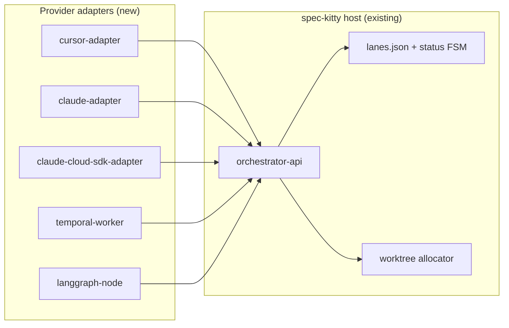

# Orchestrator Integration Roadmap

This document is a **plan**, not shipped behavior. It builds on the model in [Work Package Parallelization and Scheduling](wp-parallelization-scheduling.md) and dogfooding notes in [orchestration findings](../engineering_notes/finding/2026-05-24-mission-01KSAF14-orchestration-findings.md).

## Goals

1. **Framework-agnostic scheduling** — Any orchestrator (Temporal, LangGraph, Airflow, custom CI) can drive missions through the existing `orchestrator-api` without reimplementing lane logic.
2. **Native host ergonomics** — Cursor subagents, Claude Code `Task` tool, and cloud agent SDKs become first-class *adapters*, not copy-pasted skill prose.
3. **Less operator toil** — Automate mechanical steps (upstream lane merge, stall detection, policy validation) that today require prompt instructions.
4. **Preserve the host boundary** — `spec-kitty` remains the sole mutator of workflow state and git-safe operations.

## Non-goals

- Re-bundling a monolithic orchestrator inside the Spec Kitty repo (removed intentionally; enforced by CI).
- Replacing agent harnesses — Spec Kitty schedules *when* and *where*; agents still implement and review.
- Mandating a single cloud vendor — adapters should be pluggable.

---

## Current integration surface (baseline)

| Surface | Status | Best for |
|---------|--------|----------|
| `spec-kitty orchestrator-api` | Stable JSON contract | Any external scheduler |
| `spec-kitty-orchestrator` (PyPI) | Reference provider | Local Claude+Codex automation |
| `spec-kitty-implement-review` skill | Skill-only subagent patterns | Claude Code, manual Cursor sessions |
| `spec-kitty agent tasks status --json` | Advisory `parallelization` field | Human or LLM planners |
| `spec-kitty next --json` | Single-agent decision loop | Interactive harnesses |

**Gap:** Providers must assemble prompts, workspace paths, merge steps, and agent CLIs themselves. Framework and SDK integrations are undocumented and uneven.

---

## Architecture target



**Principle:** Adapters call the host API. They never write `status.events.jsonl` or `lanes.json` directly.

---

## Phase 1: Host ergonomics (Spec Kitty repo)

Low-risk host improvements that benefit every provider, including manual Cursor sessions.

### 1.1 Auto-merge approved dependency lanes at claim time (F-02)

**Problem:** Downstream lane worktrees do not see upstream lane commits unless the implementer manually merges.

**Plan:**

- In `agent action implement` / `start-implementation`, after worktree allocation:
  - Read `lanes.json` and WP dependency graph.
  - For each upstream lane branch with all WPs `approved` or `done`, merge into current worktree (fail with structured error on conflict).
- Emit merge evidence in implementation prompt metadata.
- Add `--skip-dependency-merge` escape hatch for advanced operators.

**Acceptance:** Cross-lane dependent WP can implement without manual `git merge kitty/mission-…-lane-*` in the prompt.

### 1.2 Enrich `list-ready` and `mission-state` payloads

**Plan:** Extend JSON responses with scheduling hints already computed internally:

```json
{
  "wp_id": "WP04",
  "lane_id": "lane-d",
  "parallel_group": 2,
  "depends_on_lanes": ["lane-b", "lane-c"],
  "suggested_impl_agent": "claude",
  "workspace_would_be": ".worktrees/my-feature-01J6XW9K-lane-d"
}
```

**Acceptance:** External orchestrators do not re-parse `lanes.json` and task frontmatter for scheduling metadata.

### 1.3 `orchestrator-api schedule-preview` (read-only)

**Plan:** New subcommand returning the full parallel execution plan:

- Lane DAG with `parallel_group` waves
- WPs per wave with dependency edges
- Current status overlay from `status.events.jsonl`
- Estimated `max_parallelism` per wave

**Acceptance:** One command replaces ad-hoc inspection of `lanes.json` + `agent tasks status`.

### 1.4 Stall and orphan detection

**Plan:** From orchestration findings (F-07+):

- `doctor orchestration --mission <slug> --json` reporting WPs `in_progress` beyond configurable TTL, claimed but no recent events, or `for_review` without reviewer activity.
- Optional webhook/event hook for external monitors (stretch).

---

## Phase 2: Reference adapters (spec-kitty-orchestrator + docs)

Ship **thin, documented adapters** beside the PyPI orchestrator rather than inside the host.

### 2.1 Adapter interface sketch

```python
class HostClient:
    def list_ready(self, mission: str) -> list[ReadyWp]: ...
    def start_implementation(self, mission: str, wp: str, policy: dict) -> ImplementationSession: ...

class AgentRunner(Protocol):
    def run_implementation(self, session: ImplementationSession) -> RunResult: ...

class OrchestratorLoop:
    def __init__(self, host: HostClient, runner: AgentRunner, max_concurrent: int): ...
    async def run_until_complete(self, mission: str) -> None: ...
```

Concrete `AgentRunner` implementations:

| Runner | Dispatches via |
|--------|----------------|
| `ClaudeCodeRunner` | `claude -p` in workspace |
| `CodexRunner` | `codex exec` stdin |
| `CursorRunner` | `cursor agent` with timeout/retry |
| `CursorSubagentRunner` | Cursor Cloud Agent API / subagent spawn (when available) |
| `ClaudeTaskRunner` | Documents `Task(subagent_type=..., run_in_background=True)` for in-IDE use |

### 2.2 Framework recipes (documentation + examples)

Publish copy-paste starters under `docs/how-to/`:

| Guide | Pattern |
|-------|---------|
| **Temporal** | One activity = `start-implementation` + agent run + `transition`; workflow encodes lane DAG waves |
| **LangGraph** | Node per WP state; conditional edges from `list-ready`; parallel fan-out via Send API |
| **GitHub Actions** | Matrix job over `schedule-preview` wave; one runner per WP |
| **Kubernetes Job** | Job per lane; init container calls `start-implementation` |

Each recipe uses the same host API — no framework-specific state in Spec Kitty.

---

## Phase 3: Native Cursor integration

Cursor is **Tier 2** today (`timeout cursor agent`). Native subagent and cloud agent capabilities need a deliberate adapter.

### 3.1 Cursor IDE subagent adapter

**Plan:**

- New skill fragment: `spec-kitty-cursor-orchestrate` (or extend `spec-kitty-implement-review`) with Cursor-native `Task` / subagent invocation — mirroring the Claude Code `Task` block but using Cursor's agent API.
- Document required prompt envelope: workspace path, prompt file path, handoff commands (`move-task`, `mark-status`).
- Provide a **session manifest** JSON written by `start-implementation` that subagents consume:

```json
{
  "wp_id": "WP02",
  "workspace": "/path/.worktrees/foo-lane-b",
  "prompt_path": "/path/.kittify/prompts/WP02-implement.md",
  "handoff_commands": [
    "spec-kitty agent tasks move-task WP02 --to for_review --note '...'"
  ]
}
```

### 3.2 Cursor Cloud Agents

**Plan:**

- Document cloud agent constraints: repo access, branch checkout, secret handling.
- Adapter spawns cloud agent with:
  - Branch = lane branch name from `start-implementation`
  - Initial prompt = contents of `prompt_path`
  - Completion webhook → orchestrator calls `transition`
- Align with org rule: cloud agents only for approved org repos.

### 3.3 Cursor background agent orchestration mode

**Plan:** Optional `.kittify/config.yaml` section:

```yaml
orchestration:
  cursor:
    max_concurrent_subagents: 2
    implement_timeout_seconds: 3600
    review_timeout_seconds: 1800
```

Host does **not** spawn subagents — a Cursor-resident orchestrator skill reads this config when fanning out `Task` calls.

---

## Phase 4: Native Claude integration

### 4.1 Claude Code `Task` tool — promote to generated command

**Plan:**

- `spec-kitty agent orchestrate cursor|claude --mission <slug> --dry-run` emits a **dispatch script** (Python or shell) with pre-filled `Task(...)` blocks for each ready WP in the current wave.
- Script is regenerated after each wave completes (idempotent).

### 4.2 Claude Agent SDK / Cloud SDK

**Plan:**

- `ClaudeAgentSdkRunner` in spec-kitty-orchestrator:
  - Creates SDK session with working directory = lane worktree
  - Injects implementation prompt as first user message
  - Parses tool-use results for `move-task` completion (or orchestrator polls `mission-state`)
- Document authentication, cost caps, and `--policy` mapping for audit trail.

### 4.3 Implement/review agent separation

Already supported at orchestrator level (`--impl-agent` / `--review-agent`). Roadmap item: expose in `schedule-preview` as recommended pairing per WP `agent_profile` frontmatter.

---

## Phase 5: Policy, observability, and DX

### 5.1 Unified policy schema documentation

- Single reference page mapping `--policy` JSON fields to audit log entries.
- Validator error messages linked from skill prose (addresses F-01 class issues).

### 5.2 Orchestration dashboard hooks

- Export `parallelization` + `schedule-preview` data to SaaS tracker (when `tracker_connectors` enabled).
- Read-only "wave timeline" view: planned vs actual parallelism.

### 5.3 Contract versioning

- Continue `contract-version` + `min_supported_provider_version` gate.
- Publish adapter compatibility matrix per Spec Kitty release.

---

## Suggested implementation order

| Priority | Item | Repo | Depends on |
|----------|------|------|------------|
| P0 | Fix execution-lanes doc drift | spec-kitty | — |
| P0 | `wp-parallelization-scheduling.md` (this docs PR) | spec-kitty | — |
| P1 | Auto-merge dependency lanes at claim (F-02) | spec-kitty | — |
| P1 | Enriched `list-ready` / `schedule-preview` | spec-kitty | — |
| P2 | Framework recipe docs (Temporal, LangGraph, GHA) | spec-kitty docs | schedule-preview |
| P2 | `HostClient` + runner split in orchestrator | spec-kitty-orchestrator | enriched API |
| P3 | Cursor subagent manifest + skill | spec-kitty doctrine | session manifest |
| P3 | Claude dispatch script generator | spec-kitty | schedule-preview |
| P4 | Claude Agent SDK runner | spec-kitty-orchestrator | SDK stability |
| P4 | Cursor Cloud Agent adapter | spec-kitty-orchestrator | cloud API |

---

## Success criteria

1. An operator can read one explanation page and know **where parallelism is decided** and **what they must configure**.
2. A Temporal (or LangGraph) engineer can integrate in **under a day** using API + recipe doc, without reading Python lane code.
3. A Cursor user can fan out subagents for all WPs in a `parallel_group` wave without hand-merging upstream lanes.
4. A Claude Code user can run a generated dispatch script instead of copying `Task(...)` blocks from a skill.
5. No regression to host boundary: all state mutations still flow through `orchestrator-api` or documented CLI commands.

---

## Open questions

1. **Should the host expose `max_concurrent`?** Today it is provider-only. Exposing it in config would be advisory unless the host enforces claim limits.
2. **Claim leasing:** Should `start-implementation` support TTL leases to recover orphaned `in_progress` WPs?
3. **Cross-mission orchestration:** `spec-kitty-program-orchestrate` skill handles multi-repo programs — should schedule-preview span missions?
4. **Squash merge vs per-WP done events (F-03):** Orchestration roadmap should not depend on merge strategy, but providers need clear guidance on status authority.

Track decisions in `architecture/3.x/adr/` when implementation begins.

---

## See also

- [Work Package Parallelization and Scheduling](wp-parallelization-scheduling.md)
- [Multi-Agent Orchestration](multi-agent-orchestration.md)
- [Build a Custom Orchestrator](../how-to/build-custom-orchestrator.md)
- [Orchestration findings](../engineering_notes/finding/2026-05-24-mission-01KSAF14-orchestration-findings.md)
