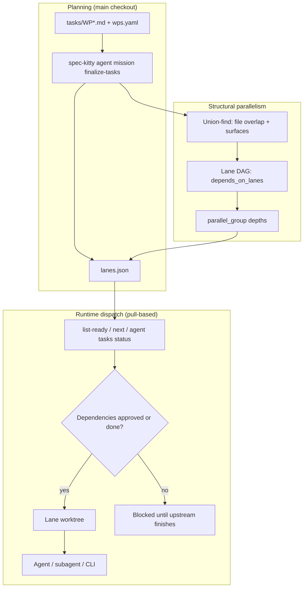

# Work Package Parallelization and Scheduling

Spec Kitty does not ship a central job scheduler. Parallelism is **structural** (computed at planning time), **gated** (enforced at claim time), and **dispatched** (by operators, host agents, or external orchestrators). This page explains all three layers and how users participate in each.

## Answer summary

| Layer | When | What decides parallelism | User role |
|-------|------|--------------------------|-----------|
| **Lane assignment** | `finalize-tasks` | `owned_files`, surface heuristics, lane DAG | Author WPs with disjoint ownership; declare real dependencies |
| **Claim gating** | `implement` / `start-implementation` | WP dependency graph + status FSM | Choose which ready WP to start; configure risk policy |
| **Dispatch** | Runtime | Orchestrator, skill, or manual commands | Run agents, set `--max-concurrent`, approve automation |

---

## Mental model: three cooperating mechanisms



1. **Lanes** answer: *Which WPs must share a worktree because they would collide on disk?*
2. **Dependencies** answer: *Which WPs must wait for upstream work to reach `approved` or `done`?*
3. **Dispatch** answers: *Among ready WPs, which ones do we start now, and with which agent?*

These are intentionally separate. Dependencies do **not** automatically collapse WPs into the same lane — that design preserves parallel upstream workstreams that fan in at a later WP.

---

## Layer 1: Lane assignment (`finalize-tasks`)

**Command:** `spec-kitty agent mission finalize-tasks --mission <slug>`

**Output:** `kitty-specs/<mission>/lanes.json`

### What goes into a lane

The lane algorithm (`specify_cli.lanes.compute`) groups work packages with a union-find structure. Two WPs land in the **same lane** when:

1. **Write-scope overlap** — their `owned_files` globs intersect.
2. **Surface heuristic** — they predict the same surface tag (for example `api`, `dashboard`) and ownership is not provably disjoint.

WPs in the same lane run **sequentially** in one git worktree and one lane branch. WPs in different lanes with satisfied dependencies can run **concurrently** in separate worktrees.

### What does *not* collapse lanes

**Dependency edges alone do not merge lanes.** If WP B depends on WP A but they touch disjoint files, they stay in separate lanes. The dependency becomes a **lane-level edge** instead:

- `depends_on_lanes` — upstream lane IDs that must complete before this lane starts.
- `parallel_group` — lanes at the same depth in the lane DAG may run in parallel.

This is the key design choice for preserving parallelism:

```text
Lane A (WP01) ──┐
                ├──> Lane C (WP04 fan-in)
Lane B (WP02) ──┘
```

Lanes A and B can run at the same time. Lane C waits until both finish.

### `lanes.json` fields operators should inspect

| Field | Meaning |
|-------|---------|
| `lanes[].wp_ids` | Execution order within the lane |
| `lanes[].depends_on_lanes` | Upstream lanes that must complete first |
| `lanes[].parallel_group` | Same number ⇒ may run concurrently (if deps satisfied) |
| `collapse_report` | Why WPs were forced into the same lane |

Example `collapse_report` entry:

```json
{
  "wp_a": "WP02",
  "wp_b": "WP03",
  "rule": "write_scope_overlap",
  "evidence": "overlapping owned_files: src/foo.py"
}
```

### Planning-artifact WPs

WPs marked `execution_mode: planning_artifact` share the canonical `lane-planning` lane and run in the **main repository checkout**, not a worktree. Limited parallelism is expected for planning-only missions.

### Risk scoring (operator policy)

At finalize time, Spec Kitty scores cross-lane pairs in the same `parallel_group` for conflict risk (shared parent directories, import coupling, shared test surfaces). Policy lives in `.kittify/config.yaml`:

```yaml
policy:
  risk:
    mode: warn   # warn | block | off
    threshold: 0.6
```

When `mode: block` and risk exceeds the threshold, `finalize-tasks` fails closed so operators must narrow `owned_files` or accept sequential lanes.

---

## Layer 2: Runtime claim gating

Lane assignment defines *possible* parallelism. Claim gating defines *legal* starts **right now**.

### Dependency readiness

Before a WP moves from `planned` to `claimed` / `in_progress`, every dependency must be in `approved` or `done`:

```python
# specify_cli.core.dependency_graph.dependency_readiness_for_wp
# Satisfying lanes: approved OR done (not done-only — avoids same-mission deadlock)
```

Enforced in:

- `spec-kitty agent action implement`
- `spec-kitty orchestrator-api start-implementation`

Re-invoking `implement` on an already `in_progress` WP is a **resume** (no re-gate).

### Discovery commands (no side effects)

| Command | Behavior |
|---------|----------|
| `spec-kitty orchestrator-api list-ready --mission <slug>` | All WPs with satisfied dependencies and `not_started` status |
| `spec-kitty next --agent <name> --mission <slug> --json` | Next implement/review/terminal action for one agent |
| `spec-kitty agent tasks status [--json]` | Kanban board plus **advisory** parallelization analysis |

The status board's `_analyze_parallelization` helper groups ready WPs into:

- **parallel** — multiple ready WPs with no inter-dependencies
- **single** — one ready WP
- **sequential** — ready but blocked by another ready WP in the same wave

This analysis is **informational**. Nothing in the host auto-starts WPs based on it.

### Cross-lane content inheritance (known gap)

When a downstream lane depends on an upstream lane, the downstream worktree is created from the mission branch **at claim time**. It does **not** automatically include commits from upstream lane branches that finished while it was waiting.

Operators (or implement prompts) must merge upstream lane branches into the downstream worktree before coding. See [F-02 in orchestration findings](../engineering_notes/finding/2026-05-24-mission-01KSAF14-orchestration-findings.md). Auto-merge at claim time is a planned host improvement.

---

## Layer 3: Dispatch and orchestration

Spec Kitty separates **host** (state, lanes, git-safe mutations) from **provider** (who runs agents and when).

```text
┌─────────────────────────────────────────────┐
│  spec-kitty (host)                          │
│  lanes.json, status.events.jsonl, worktrees │
│  agent workflow + orchestrator-api          │
└──────────────────┬──────────────────────────┘
                   │ JSON contract only
┌──────────────────▼──────────────────────────┐
│  Provider (pick one)                          │
│  • Manual / skill-driven (Cursor, Claude)     │
│  • spec-kitty-orchestrator (PyPI)             │
│  • Custom framework (Temporal, CI, etc.)      │
└─────────────────────────────────────────────┘
```

There is **no in-repo scheduler loop**. Parallelism caps (for example `--max-concurrent 3`) live in the **provider**, not the host.

### Style A: Manual or single-agent coordination

An operator or one long-lived agent drives the loop:

```bash
spec-kitty agent tasks status --json          # see parallel_groups
spec-kitty agent action implement WP02 --agent claude
spec-kitty agent action implement WP03 --agent codex   # different terminal / subagent
```

Each `implement` allocates or reuses the correct lane worktree. The operator chooses **which** ready WPs to start and **when**.

### Style B: Host-agent skill (`spec-kitty-implement-review`)

The bundled skill teaches any capable host agent to:

1. Call `agent action implement` to claim and get workspace + prompt paths.
2. Dispatch work via **subagents** (Claude Code `Task` tool) or **Tier-1 CLIs** (`claude`, `codex`, etc.).
3. Drive `move-task` transitions through review cycles.

Subagents are a **host-agent pattern**, not a Spec Kitty runtime primitive. The skill recommends `run_in_background=True` so one orchestrator can fan out multiple WPs:

```python
# Claude Code Task tool (from spec-kitty-implement-review skill)
Task(
    subagent_type="general-purpose",
    description="Implement WP02",
    prompt="cd <workspace> && cat <prompt_file> ...",
    run_in_background=True,
)
```

**Agent dispatch tiers** (from the skill):

| Tier | Examples | Orchestrator responsibility |
|------|----------|----------------------------|
| 1 | Claude, Codex, Gemini, OpenCode | Fire-and-forget CLI; agent runs `move-task` |
| 2 | Cursor (`cursor agent`) | Timeout wrapper; may need retry |
| 3 | Windsurf, Roo (GUI-only) | Orchestrator must run `move-task` after human finishes |

### Style C: External orchestrator (`spec-kitty-orchestrator`)

The supported automation path for unattended multi-agent runs:

```bash
spec-kitty orchestrator-api contract-version
spec-kitty-orchestrator orchestrate \
  --mission <slug> \
  --impl-agent claude-code \
  --review-agent codex \
  --max-concurrent 2
```

Provider responsibilities:

1. Poll `list-ready` (or `mission-state`).
2. Call `start-implementation` / `start-review` / `transition` with required `--policy` JSON.
3. Run agent CLIs in returned `workspace_path` using `prompt_path`.
4. `accept-mission` then `merge-mission` when all WPs are terminal.

See [Run the External Orchestrator](../how-to/run-external-orchestrator.md) and [Orchestrator API Reference](../reference/orchestrator-api.md).

### Style D: Tasks-phase subagent fan-out (planning only)

During `/spec-kitty.tasks`, the `tasks-packages` prompt instructs the planning agent to dispatch **one sub-agent per WP** to author WP files concurrently. This parallelizes **spec authoring**, not implementation. Implementation parallelism still flows through lanes and `implement`.

---

## How users shape the schedule

### At planning time (highest leverage)

| User action | Effect on parallelism |
|-------------|----------------------|
| Declare tight `owned_files` per WP | More lanes ⇒ more concurrent worktrees |
| Add `dependencies` only when ordering is required | Fewer false serialization points |
| Use `[P]` markers in task outlines | Signals safe parallel subtasks to planners |
| Run `finalize-tasks --validate-only` | Preview lanes and collapse before commit |
| Set `policy.risk.mode: block` | Fail closed on risky parallel lane pairs |
| Assign `agent_profile` per WP | Routes implement/review to different profiles |

### At execution time

| User action | Effect on parallelism |
|-------------|----------------------|
| Start multiple `implement` commands for independent ready WPs | Manual parallel dispatch |
| Use `agent tasks status` | See `parallelization.parallel_groups` in JSON |
| Set `--max-concurrent` on external orchestrator | Cap simultaneous agent processes |
| Pass `--agent` on every implement claim | Required; prevents abandoned claims |
| Configure `agents.available` in `.kittify/config.yaml` | Limits which CLIs orchestrator may use |
| Merge upstream lane branches (today) | Required for cross-lane deps until auto-merge lands |

### At review and merge time

| User action | Effect |
|-------------|--------|
| Approve WPs (`approved`) | Unblocks dependent WPs without waiting for merge |
| `spec-kitty accept` + `spec-kitty merge` | Integrates lane branches → mission branch → target |
| Choose merge strategy (`merge` vs `squash`) | Squash may collapse per-WP `done` events (see F-03) |

---

## Concurrency safety in the host

When multiple lanes run in parallel, the host still serializes sensitive operations:

| Mechanism | Purpose |
|-----------|---------|
| `feature_status_lock` | Serialize `status.events.jsonl` writes across worktrees |
| `MachineFileLock` in auto-rebase | Serialize `uv.lock` regeneration |
| `lane_test_env` / `SPEC_KITTY_TEST_DB_NAME` | Isolate test databases per lane |
| Lane worktree reuse | Sequential WPs in one lane share one checkout |
| Stale-lane detection + auto-rebase | Reduce parallel drift before merge |

---

## End-to-end example

**Mission:** four WPs, fan-out then fan-in.

```text
WP01 (lane-a, foundation)
  ├─ WP02 (lane-b, API)     parallel_group 1
  └─ WP03 (lane-c, UI)      parallel_group 1
WP04 (lane-d, integration) parallel_group 2, depends_on lane-b + lane-c
```

1. **Planning:** Operator authors WPs with disjoint `owned_files`. `finalize-tasks` writes `lanes.json` with three parallel groups.
2. **Wave 1:** Operator (or orchestrator) runs `implement WP01`. No other WP is claimable until WP01 reaches `approved`.
3. **Wave 2:** `list-ready` returns WP02 and WP03. Orchestrator starts both with `--max-concurrent 2` — two worktrees, two agents.
4. **Wave 3:** When WP02 and WP03 are `approved`, WP04 becomes ready. Implementer merges lane-b and lane-c branches into lane-d worktree (manual today).
5. **Closeout:** `accept` → `merge` integrates all lane branches.

---

## What Spec Kitty does *not* do today

- No built-in cron or queue scheduler inside the host CLI.
- No first-class Cursor subagent or Claude Cloud SDK integration in runtime code — only skill guidance and CLI dispatch.
- No automatic upstream lane merge at claim time (F-02).
- No cloud-agent provisioning — external orchestrator assumes local agent CLIs unless you build otherwise.

For the plan to close these gaps and integrate with orchestrator frameworks, see [Orchestrator Integration Roadmap](orchestrator-integration-roadmap.md).

---

## See also

- [Execution Lanes](execution-lanes.md) — worktree naming, collapse report, test DB isolation
- [Multi-Agent Orchestration](multi-agent-orchestration.md) — host/provider split and API boundary
- [Kanban Workflow](kanban-workflow.md) — nine-lane status FSM
- [How to Develop in Parallel](../how-to/parallel-development.md) — operator quick start
- [Orchestrator Quickstart](../tutorials/orchestrator-quickstart.md) — automated path
- [Build a Custom Orchestrator](../how-to/build-custom-orchestrator.md) — roll your own provider
- [Orchestration findings (dogfooding)](../engineering_notes/finding/2026-05-24-mission-01KSAF14-orchestration-findings.md) — real-world friction points
