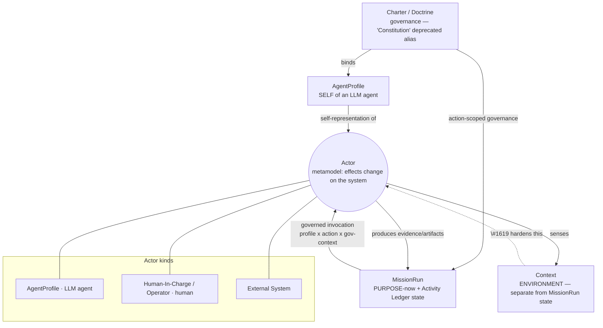

# 12 — Actor Mental Model: Self · Purpose · Environment

**Phase:** abstraction-level-up · **Date:** 2026-06-03

A deliberate step *up* from the context plumbing to ask: **what is an actor, and what does any actor
need in order to do what it is supposed to do?** Stijn's framing — an actor needs a **sense of self**,
a **sense of purpose**, and a **sense of environment** — maps cleanly onto spec-kitty's core nouns
and, crucially, **explains why #1619 matters**: for an LLM agent, the runtime *is* the sensory organ,
so any distortion in how it assembles self/purpose/environment is felt directly as bad behaviour.

> Mental-model doc, not a code survey. Citations are illustrative; the value is the framing.

**Refinements incorporated (Stijn, 2026-06-03):** (1) **Constitution == Charter** — "Constitution" is
a **deprecated alias**; Charter is canonical. (2) The **Activity Ledger is MissionRun state**
(purpose-side); the operational **environment is a related but separate concern**. (3) **Actor** is a
**metamodel concept** — *someone/something effecting change upon the system* — that disambiguates into
**AgentProfile** (LLM agent), **Human-In-Charge / Operator** (human), and **External System**.
(4) This model will likely graduate to a published `docs/architecture/` doc once crystallized.

---

## 1. The three senses

| Sense | The actor's question | Spec-kitty source |
|-------|----------------------|-------------------|
| **Self** | *Who am I? What may I do? Where are my limits?* | the actor's **kind** (see §3): **AgentProfile** for an LLM agent; **Operator/Human-In-Charge** for a human; **service identity** for an external system |
| **Purpose** | *Why am I doing this, toward what, under what rules?* | **MissionRun** (immediate: mission/step/WP + intent + activity ledger) **bounded by Charter** (enduring: values, directives, approaches) |
| **Environment** | *Where am I? What's the state? What tools/branches? Who else is acting?* | **Context** — filesystem/VC/(projected) mission-state projection (**the #1619 overhaul**) |

The senses are **layered, not independent**: purpose is bounded by self (a profile's boundaries
constrain which purposes it may pursue); action in the environment is bounded by purpose (the mission
step + directives say what's legitimate here). **Self → Purpose → Environment is a containment order.**

---

## 2. Concept map

```
                  ┌────────────────────────────────────┐
                  │        CHARTER / DOCTRINE           │  governance: values · directives · tactics ·
                  │  (governance — "Constitution" is a  │  paradigms · selected approaches ·
                  │       deprecated alias)             │  profile bindings  (action-scoped)
                  └─────┬────────────────────────┬──────┘
              selects & │                        │ provides action-scoped
              binds     ▼                        ▼ governance bundle
            ┌────────────────────┐   ┌───────────────────────────────┐
            │   AGENT PROFILE    │   │          MISSION RUN           │
            │ (a disambiguation  │   │       ── PURPOSE (now) ──      │
            │  of ACTOR; the     │   │ mission · step · WP · intent   │
            │  SELF of an LLM    │   │ decisions                       │
            │  agent)            │   │ ACTIVITY LEDGER  ◀ MissionRun  │
            └─────────┬──────────┘   │                    state       │
                      │              └──────────────┬─────────────────┘
       is the self-   │                             │ assigns a step to an actor via a
       representation │                             │ GOVERNED INVOCATION
       of an LLM-agent│                             │  = profile × action × governance-context
       actor          └──────────────┬──────────────┘
                                      ▼
          ┌─────────────────────────────────────────────────────────────┐
          │  ACTOR  — metamodel concept:                                  │
          │  "someone / something effecting change upon the system"       │
          │  disambiguates into ▼                                         │
          │    • AGENT PROFILE          (LLM agent)                        │
          │    • HUMAN-IN-CHARGE / OPERATOR   (human)                      │
          │    • EXTERNAL SYSTEM        (tracker · SaaS · git host · CI)   │
          └───────────────────────────┬─────────────────────────────────┘
                                       │ SENSES  (separate from, but related to,
                                       ▼          MissionRun state)
                          ┌────────────────────────────┐
                          │   CONTEXT — ENVIRONMENT      │  filesystem · version control ·
                          │  (where / what / who, now)   │  (projected) mission & WP state ·
                          └────────────────────────────┘  other actors · tools
                                       ▲
                                       │  the #1619 overhaul hardens THIS sense
                        (split authority today = a distorted sense of environment)
```

Mermaid (for renderers that support it):



---

## 3. Actor as a metamodel concept

**Actor** is not a fourth sibling of human/agent/system — it is the **metamodel abstraction** above
them: *someone or something that effects change upon the system.* It **disambiguates** into three concrete kinds:

> **Domain placement (per `14` Tier 1):** the Actor is **realized in the Execution/Runtime domain** —
> "effecting change" is a practical, execution-layer act. Its **beliefs** (profile, directives, sense
> of self) are sourced from **Governance**; the Actor *as a change-effector* is strictly practical.
> The **Executor Prompt** that carries its three senses is the **DTO at the Mission-Management ↔
> Execution boundary**, assembled using Governance (rules/profile) + Context (environment).

| Actor kind | Self (identity) | How it perceives | Spec-kitty representation |
|------------|-----------------|------------------|---------------------------|
| **AgentProfile** (LLM agent) | the profile *is* its self — identity, boundaries, canonical verbs | **all senses injected** via the rendered prompt | `AgentProfile` (doctrine) bound at governed invocation |
| **Human-In-Charge / Operator** | their authority/role | **self-supplied** — knows who they are, holds intent, can look around | the operator; lightly modeled (`human-in-charge` profile) |
| **External System** | a service identity + auth scope | only the **data handed to it** through an ACL | tracker / SaaS / git host / CI integrations |

So "the AgentProfile is the LLM agent's sense of self" is exact: **for an LLM-agent actor, the
AgentProfile *is* the actor's self-representation.** Humans and external systems are the other two
disambiguations of the same metamodel concept.

---

## 4. The three senses × the three actor kinds

What each actor needs, where it comes from, and **how well spec-kitty provides it today**.

| | **Self** | **Purpose** | **Environment** |
|--|----------|-------------|-----------------|
| **Operator** (Human-In-Charge) | their *authority/role* — lightly modeled; mostly implicit | they **author** purpose (intent at P1) and **decide** at gates (P0/P3/P6); bounded by Charter | needs **visibility** — dashboard/kanban/status; today fragmented by branch (#1619) |
| **LLM Agent** (AgentProfile) | **AgentProfile**, *injected* — cannot self-discover identity/boundaries | **assigned** step + action-scoped directives via governed invocation; bounded by profile + Charter | the **rendered prompt** = its *entire* perception; assembled by the runtime |
| **External System** | a *service identity* + auth scope | a *narrow contract* (sync this, track that, host the ref) | only the **data handed to it** through an Anti-Corruption Layer |

### The architectural punchline
For a **human operator**, the three senses are mostly *self-supplied*. For an **LLM agent**, **all
three senses are injected** — it has no independent perception; per ADR 2026-03-09-1 *"prompts do not
discover context, commands do."*

> **Therefore: for an LLM agent, the runtime is its sensory organ.** The prompt is not a message — it
> is the agent's *entire sensorium* of self, purpose, and environment, assembled by spec-kitty. This
> is why #1619 is not cosmetic: **split-authority context resolution feeds the agent a *distorted
> sense of environment*** (status that disagrees by branch, prompts that describe the wrong topology),
> and a confused agent is the *correct, expected* output of confused senses. The overhaul is, at this
> altitude, **fixing the agent's perception.**

And the dialectic (`11`) agrees: the agent's **self** (profile) and **purpose** (step) are *already*
resolved live and frozen-for-determinism appropriately; the weak sense is **environment**, which is
exactly the `ActionContext` we resolved to harden. The mental model and the plumbing point at the same place.

---

## 5. How the nouns relate (definitions in this frame)

- **Charter / Doctrine** — the governance: enduring values *and* the operational *how* (directives,
  tactics, paradigms, selected approaches, **profile bindings**). *("Constitution" is a deprecated
  alias for this — they are the same concept.)* Source of *purpose-as-values* and of injectable, action-scoped behaviour.
- **AgentProfile** — a reusable *template of self*: identity, specialization, boundaries, verbs,
  collaboration. **One disambiguation of Actor**; the self-representation of an LLM-agent actor.
- **MissionRun** — a persisted *instance of purposeful work*: this mission, this step, this WP, the
  intent, the decisions, and the **Activity Ledger** (provenance of who-did-what-when). **The Activity
  Ledger is MissionRun state.** Also the natural home for the plan-time-frozen interaction policy (`11`).
- **Actor** — the **metamodel concept**: *someone/something effecting change upon the system.*
  Disambiguates into AgentProfile / Operator / External System.
- **Governed invocation** — the *binding event* where MissionRun assigns a step to an Actor through an
  AgentProfile under a governance context: `profile × action × governance-context`. The moment the three senses are fused into a prompt.
- **Context** — the *environment projection* the actor senses to act. **Separate from MissionRun
  state** (though related — it may *project* relevant mission/WP state into what the actor perceives). The #1619 work.

### Relationship sentences
1. The **Charter** selects **AgentProfiles** and provides **action-scoped governance**.
2. A **MissionRun** assigns a step to an **Actor** via a **governed invocation** (profile × action ×
   governance-context), bounded by the **Charter**; the **Activity Ledger** records the pursuit as MissionRun state.
3. The **Actor** senses the **Context** (environment — separate from MissionRun state) to perform the
   step, and **produces evidence** recorded back into the **MissionRun**.
4. **External systems** participate through **Anti-Corruption Layers** — a narrow contract, only the data handed to them.

---

## 5a. The Mission is a layered domain: mission state + work-package state

> **⚠ Corrected by [13](./13-dialectic-mission-vs-missionrun.md).** This section originally attributed
> the layered state to *MissionRun*. The dialectic on "Mission ≡ MissionRun" (refuted) showed the
> layered, durable state belongs to the **Mission** (`kitty-specs/<slug>/`, git). The **Mission Run**
> is the *ephemeral session instance that drives a Mission through its steps* (`.kittify/runtime/`,
> gitignored, **1:many** to the Mission). Read below with "Mission" as the owner of the two layers.

**Refinement (Stijn, 2026-06-03; ownership corrected per `13`):** the **Mission** is **not flat** — it
is a two-layer system. This matters because the two layers hold *different senses* and change at
*different rates*. (The **Mission Run** is a separate, ephemeral driver — see `13`.)

```
  MISSION RUN  (a persisted instance of purposeful work)
  │
  ├── MISSION-LEVEL STATE  (macro — one per run)
  │     • identity: mission_id · mid8 · slug · mission_run_id · mission_type
  │     • phase / lifecycle position           (distributed-first-class; see 11)
  │     • topology: target branch · coordination branch · lanes plan
  │     • interaction policy  (plan-time-frozen; see 11)
  │     • activity ledger      (provenance of pursuit — MissionRun state)
  │     • aggregate progress   (a roll-up of the WP layer)
  │
  └── WORK-PACKAGE STATE  (micro — one per WP)
        • lane            (9-state FSM)                         ← PURPOSE (this unit)
        • agent_profile · role                                 ← SELF (the bound actor)
        • model · tool                                         ← execution preference
        • work location: lane worktree / workspace_path        ← ENVIRONMENT (where)
        • dependencies · evidence · claim/actor
```

**The key insight:** the **work-package layer is where the *governed invocation* binds an actor's
three senses to a concrete unit of work.** The mission layer holds *standing* purpose, topology, and
policy; the WP layer holds the *per-unit* instantiation — `agent_profile`/`role` (self),
`lane`+intent (purpose-here), `work location`+`tool`+`model` (environment + execution preference).
So §1's "self / purpose / environment" are **resolved at mission level but instantiated at WP level.**

This is the actor-model restatement of the architecture's **two-dimensional accounting** commitment
(ADR `2026-04-03-1`, see `03` A1: *"lanes own git, WPs own accounting; lane state AND WP state must
both be visible"*). It also locates the prior work precisely: the **`MissionStatus` aggregate**
(`07` §4 / `09` F5) **is the WP-layer state machine**; the **mission-level state is a distinct,
smaller object** that references WP states by identity and rolls them up.

**Open modeling question — the aggregate boundary.** Is MissionRun **one** aggregate root containing
WP entities, or **two** aggregates (Mission state + WorkPackage state) referenced by identity? The
Aggregate Design Rules (`04`: small aggregates, reference by identity, coordinate by events) and our
own `07` §4 finding (dependency gating must live *outside* the per-WP aggregate because it crosses WP
boundaries) both point toward **two aggregates** — a mission-level aggregate that references many
WP-level aggregates by `mission_id`+`wp_id` and computes roll-up progress, rather than one giant
mission aggregate. To confirm when we draw the model diagram.

---

## 6. Why this framing earns its keep

1. **A test for completeness.** Any step in idea→working-code can be checked: *does the actor have a
   clear sense of self, purpose, and environment here?* Missing or distorted = a defect.
2. **Separation by source.** Self ← actor-kind (Profile/Operator/System); Purpose ← MissionRun +
   Charter; Environment ← Context. Different domains, different change rates — the same separation the
   context work (`09`) and the layer law enforce, now justified from the actor's needs.
3. **It explains the actor asymmetry.** Operators self-supply senses; agents have them injected;
   external systems get a narrow slice. The *runtime's responsibility scales with how blind the actor
   is* — highest for LLM agents. That tells us where correctness matters most: agent prompt assembly.
4. **It re-frames #1619 as perception, not paths.** The bug class is the runtime distorting the
   agent's sense of environment — a more correct and more motivating problem statement.

---

## 7. Resolved (this round) and still open

**Resolved with Stijn:**
- **Constitution == Charter** (Constitution deprecated). ✅
- **Activity Ledger = MissionRun state**; environment is a related-but-separate concern. ✅
- **Actor = metamodel concept** → {AgentProfile, Operator/Human-In-Charge, External System}. ✅
- **Will graduate to a published `docs/architecture/` doc** once crystallized. ✅ (tracked)

**Still open:**
1. **Operator self** — do we model the human's authority/role more explicitly (is `human-in-charge` a
   real gating profile; do operators carry a profile)?
2. **Activity-Ledger-as-environment projection** — the ledger *lives in* MissionRun, but the next
   actor senses prior activity. Define the **projection** that surfaces relevant ledger/mission state
   *into* Context, without making Context an owner of that state (one-writer rule, `04`).
3. **`Actor` in code** — do we introduce a thin shared `Actor` type (`identity` + `senses()`), or keep
   the three kinds separate and use "Actor" only as modeling vocabulary? (Lean: vocabulary now, type
   only if a shared seam emerges.)
4. **Naming of the fusion event** — keep "governed invocation," or a clearer term for "the moment a
   prompt is assembled from the three senses"? (DIRECTIVE_032.)
