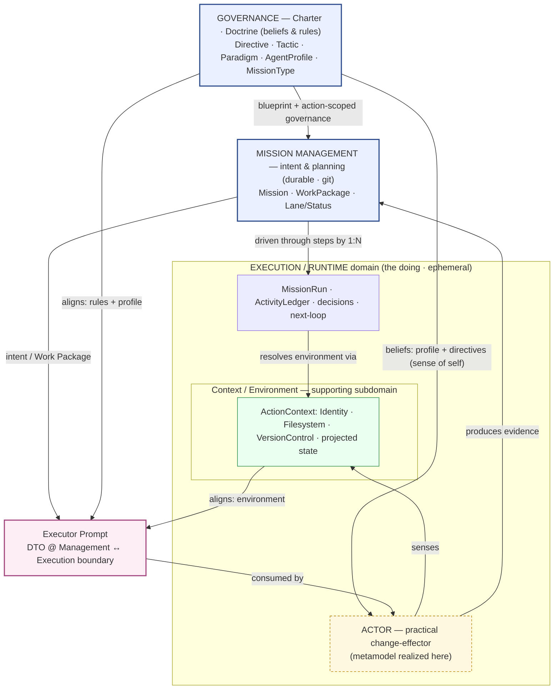
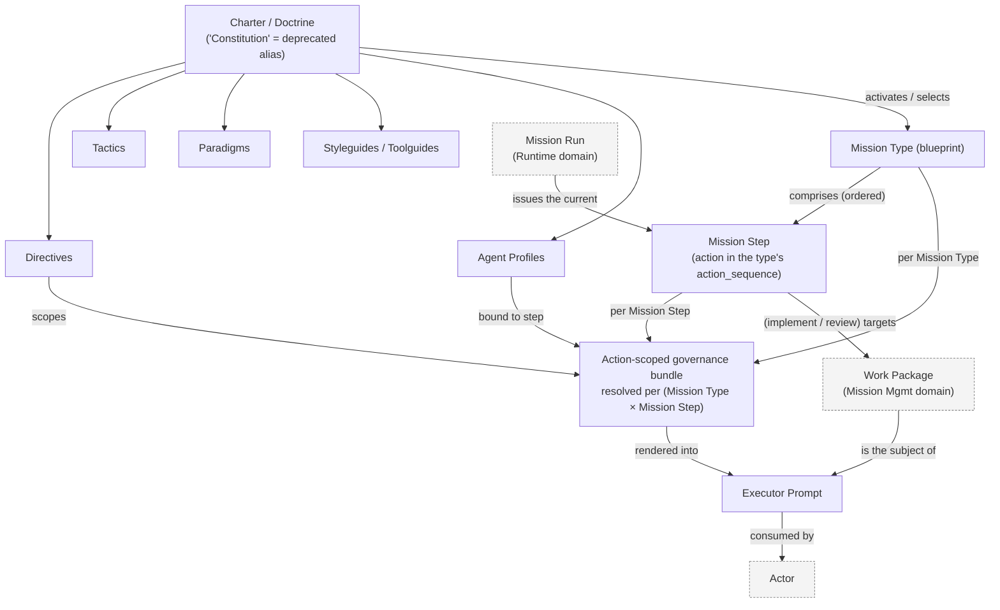
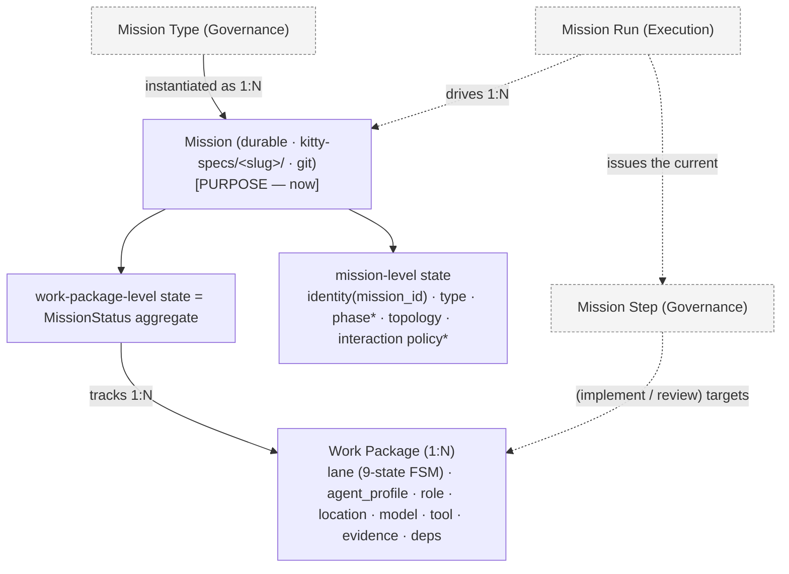
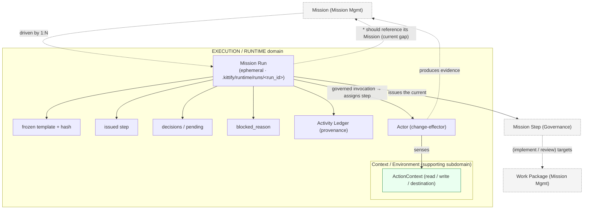
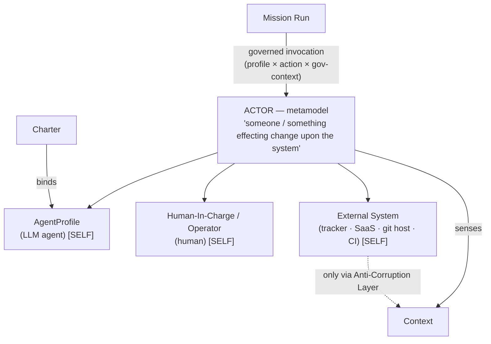
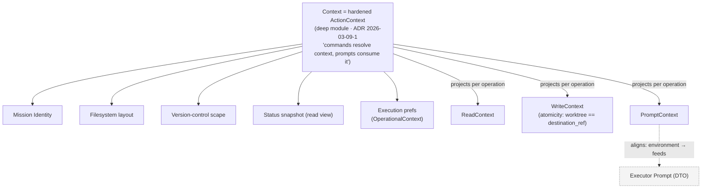
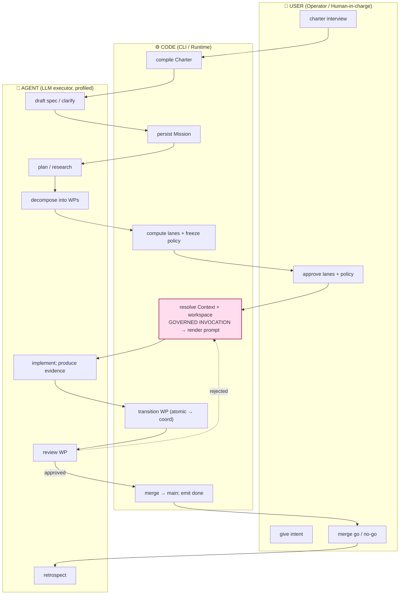

# 14 — Model Diagrams (multi-tier)

**Phase:** 2 (conceptual modeling) · **Date:** 2026-06-03 · **Persona:** Architect Alphonso (architecture
domain/model diagramming). *Note: "diagram-daisy" is not a registered profile; the only designer
profile, `designer-dagmar`, is UX/UI and explicitly avoids system architecture — so architecture
domain/model diagrams stay with the architect.*

Compiles the provisional concept map (`12` §2, corrected by `13`) into a **tiered** set:
**Tier 1** = domain overview + interrelations; **Tier 2** = per-domain disambiguation / drill-down;
plus a **Process view** (BPMN swimlane over idea→working-code) and an **Interaction view**
(governed-invocation sequence).

**Notation.** `─▶` relation · `1:N` cardinality · dashed/`*` = provisional or known-gap · `[SELF|PURPOSE|ENV]`
= which actor-sense a thing supplies. Mermaid blocks render on GitHub and most viewers; ASCII fallbacks
are inline where useful.

---

## Tier 1 — Domain overview & interrelations

> **⚠ Superseded by [17](./17-consolidated-domain-model.md)** (the consolidated, code-validated baseline).
> The dialectic (`15`) + fan-out (`16`) reworked this Tier 1: **ExecutionContext** does live in Execution,
> but the shared resolver math is a **Shared Kernel code module**; **Context is per-domain**
> (GovernanceContext / ExecutionContext / InfraContext); **Status/kanban** is its own shared context;
> **Actor↔Effector** (Effector = Actor realized in Execution); the prompt is a **communication artefact**.
> Read `17` for the current model; the diagrams below are retained as the journey's intermediate sketch.

**Three top-level domains**, with **Context as a subdomain of Execution** and two boundary/cross-cutting
concepts (**Actor**, **Executor Prompt**). *(Refined from an earlier "four domains" draft per Stijn's
cross-tier feedback — see the refinements note below; partially refuted by `15`.)*

- **Governance** (Charter · Doctrine) — *beliefs & rules*: Directive · Tactic · Paradigm · AgentProfile · **MissionType**.
- **Mission Management** *(intent & planning; durable · git · `kitty-specs/`)* — **Mission** · **WorkPackage** · **Lane/Status** (MissionStatus agg). Identity: `mission_id`.
- **Execution / Runtime** *(the doing; ephemeral · `.kittify/runtime/`)* — **MissionRun** · **ActivityLedger** · decisions · next-loop. Identity: `mission_run_id`. **Contains:**
  - **Actor** *(metamodel realized here)* — the practical change-effector; its *beliefs* (profile, directives, sense of self) are sourced from Governance.
  - **Context / Environment** *(supporting subdomain)* — the hardened `ActionContext` + fragments. The one part still being built.
- **Executor Prompt** *(boundary DTO)* — the entity passed **Management → Execution**, assembled from **Governance** (rules/profile) + **Context** (environment) to ensure alignment.



ASCII fallback:

```
 GOVERNANCE (beliefs & rules) ──blueprint + action-scoped governance──▶ MISSION MANAGEMENT (intent & planning)
        │  beliefs (profile / self)                                            │  driven 1:N
        │                                                                      ▼
        └──────────────────────────────────────────────▶  EXECUTION / RUNTIME (the doing)
                                                              ├─ ACTOR (practical change-effector; metamodel realized here)
                                                              └─ Context / Environment (supporting subdomain: ActionContext)

 Executor Prompt = DTO at MISSION MGMT ↔ EXECUTION boundary
     assembled from:  MISSION MGMT (intent / WP)  +  GOVERNANCE (rules / profile)  +  CONTEXT (environment)
     consumed by:     ACTOR        ;     ACTOR ── produces evidence ──▶ MISSION MANAGEMENT
```

### Domain-model refinements (Stijn, 2026-06-03) — two rounds

**Round 1 — "Mission is a concept, not a domain."** The earlier Tier 1 mixed levels (it listed
*Mission* and *Actor* as domains). Corrected:

1. **Mission is a concept** in the **Mission Management** domain (with WorkPackage and Lane/Status) —
   **not** inside Runtime. *Why not Runtime:* ADR `2026-04-04-2` mandates that *"runtime/session
   identity must remain distinct from planning/delivery identity."* **Mission** is the *durable
   planning/delivery* artifact (`mission_id`, git); **MissionRun** is the *ephemeral runtime* concept
   (`mission_run_id`). Folding Mission into Runtime would blur the boundary that ADR — and our doc `13`
   dialectic — protect. So: **Mission → Mission Management; MissionRun → Execution/Runtime.**
2. **MissionType moved into Governance** — it is a doctrine artifact (`src/doctrine/missions/mission_types/`).

**Round 2 — cross-tier refinements.** The split is confirmed, with these placements:

3. **Mission Management = "definitions of intent" + planning**; **Execution/Runtime = the doing.** The
   two are the Mission split (durable intent vs ephemeral execution).
4. **Context / Environment is a supporting *subdomain of Execution/Runtime*** — not a peer top-level
   domain. It exists to serve the runtime's resolution of *where/what/who*.
5. **Actor is realized in the Execution/Runtime domain.** "Effecting change upon the system" is a
   *practical, execution-layer* act. Its **beliefs** — profile definition, directives, sense of self —
   come from **Governance**, but the Actor *as a change-effector* is strictly practical (Execution).
   So: metamodel concept, **realized in Execution**, beliefs sourced from Governance.
6. **Executor Prompt is a boundary DTO** between **Mission Management** (intent/WP) and
   **Execution** (the Actor), **using the Governance and Context domains to ensure alignment**
   (rules/profile from Governance, environment from Context). It is the entity that carries an actor's
   three senses across the Management↔Execution seam.

This aligns with the deep-dive bounded-context map (doc `03` B: distinct "Mission lifecycle" and
"Status/kanban" contexts) and keeps domain names distinct from the concepts they contain
(DIRECTIVE_032). **Domain names remain provisional** — "Mission Management" vs "Planning & Delivery" vs
"Mission Lifecycle"; "Execution" vs "Runtime".

---

## Tier 2 — Per-domain drill-down (disambiguation)

### 2a · Governance domain

Now shown bridging into execution (the governed-invocation assembly): Mission Type → Mission Step →
governance bundle → prompt, targeting a Work Package issued by a Mission Run, consumed by an Actor.
Cross-domain concepts (other domains) are dashed.



> Disambiguation: **Charter == Doctrine governance** (Constitution deprecated) produces *enduring* rules
> and *selects* a **Mission Type**, which **comprises ordered Mission Steps**. The **action-scoped
> bundle** is keyed by **(Mission Type × Mission Step)** and combined with the **bound Agent Profile**.
> The bridge into execution: a **Mission Run** *issues* the current Mission Step; that step (for
> implement/review) *targets* a **Work Package**; the bundle is *rendered into* the **Executor Prompt**
> whose subject is that Work Package; the **Actor** *consumes* the prompt. (This static view is the
> structural counterpart to the governed-invocation sequence below.)

### 2b · Mission Management domain (the layered work) — corrected per `13`

Cross-domain concepts dashed. Shows the same execution spine as 2a, from the Mission-Management side:
a **Mission Step** (Governance) *targets* a **Work Package**; a **Mission Run** (Execution) *drives*
the Mission and *issues* that step.



> Disambiguation: the **layered state lives on the Mission** (not the Run — `13`). Mission-level =
> identity/type/phase/topology/policy; WP-level = the `MissionStatus` aggregate. The execution spine
> (dashed) is consistent with 2a/2c: **Mission Run → Mission Step → Work Package**. `*` = provisional
> (phase derived-not-enum; interaction policy resolved-and-frozen at plan time).

### 2c · Execution / Runtime domain (driver + Actor + Context) — corrected per `13`

The domain now drawn in full: it **contains** the Mission Run, the **Actor** (realized here), and the
**Context** subdomain; it reaches *out* (dashed) to Governance (Mission Step) and Mission Management
(Mission, Work Package). Same spine as 2a/2b.



> Disambiguation: a **Mission Run is one pass an actor makes through a Mission's steps** — ephemeral,
> 1:N to the Mission. The Execution domain *contains* the Run, the **Actor** (realized here; beliefs
> from Governance — 2d), and the **Context** subdomain (2e). Today the Run is degenerate: its snapshot
> stores the mission *type* but not the mission id/slug (`13`) — the dashed `should reference its
> Mission` edge is the gap to close.

### 2d · Actor (metamodel → kinds; realized in Execution)



> Disambiguation: **Actor** is not a sibling of the three kinds — it's the abstraction *above* them,
> **realized in the Execution/Runtime domain** ("effecting change" is a practical, execution-layer
> act). Its **beliefs** (profile, directives, sense of self) come from **Governance** (`binds`), but
> the Actor *as a change-effector* is strictly practical. For an LLM agent, the **AgentProfile is its
> self-representation**. Operators self-supply their senses; external systems get a narrow ACL slice.

### 2e · Context / Environment (supporting subdomain of Execution/Runtime; the #1619 target)



> Disambiguation: Context is a **supporting subdomain of Execution/Runtime** — it exists to serve the
> runtime's resolution of *where/what/who*. Its *internals* are the domain-owned fragments (`09`); its
> *outputs* are fit-for-purpose composites (Read/Write/Prompt), one of which feeds the Executor Prompt
> DTO (Tier 1). This is **the one part still being built** — by hardening the existing `ActionContext`,
> not greenfielding (`11`).

---

## The three senses, as a cross-domain overlay

| Sense | Supplied by domain | Concrete source |
|-------|--------------------|-----------------|
| **Self** | Actor | AgentProfile / Operator / External-System identity |
| **Purpose** | Mission + Governance | Mission (step/WP/intent) bounded by Charter (values/directives) |
| **Environment** | Context | filesystem · VC · projected mission/WP state |

**Fusion point:** the **governed invocation** (Runtime → Actor) is where the three senses become a
single prompt, and it binds at the **work-package** level (2b). The Interaction view below shows that fusion step by step.

---

## Process view — BPMN swimlane (idea → working code)

Three lanes (**User** / **Code** / **Agent**) across the lifecycle phases `P0…P7` (`10`). The bottom
row is the architectural payload: **what Context the Code resolves at each phase** — needs *accumulate*
P0→P3, then *project* per operation P4→P6 (`10` cross-cutting #1).

```
PHASE →   │ P0 Govern  │ P1 Frame   │ P2 Design │ P3 Decompose  │ P4 Build      │ P5 Verify   │ P6 Integrate │ P7 Learn
──────────┼────────────┼────────────┼───────────┼───────────────┼───────────────┼─────────────┼──────────────┼──────────
🧑 USER   │ charter     │ give        │            │ approve lanes  │                │ (re)open    │ merge        │
          │ interview   │ intent      │            │ + interaction  │                │ review      │ go / no-go   │
          │             │             │            │ policy         │                │             │              │
──────────┼────────────┼────────────┼───────────┼───────────────┼───────────────┼─────────────┼──────────────┼──────────
⚙️ CODE   │ compile     │ persist     │ resolve    │ compute lanes  │ resolve Context│ transition  │ merge lanes→ │ record
          │ Charter     │ Mission     │ context    │ + FREEZE       │ + workspace;   │ WP (status  │ integ→main;  │ retro
          │             │ (kitty-specs)│           │ interaction    │ GOVERNED      │ aggregate,  │ emit `done`  │
          │             │             │            │ policy         │  INVOCATION   │ atomic→coord│              │
──────────┼────────────┼────────────┼───────────┼───────────────┼───────────────┼─────────────┼──────────────┼──────────
🤖 AGENT  │             │ draft spec  │ plan /     │ decompose      │ implement in   │ review WP   │              │ synthesize
          │             │ / clarify   │ research   │ into WPs       │ workspace;     │ (reviewer   │              │ retro
          │             │             │            │                │ produce evidence│ profile)   │              │
──────────┴────────────┴────────────┴───────────┴───────────────┴───────────────┴─────────────┴──────────────┴──────────
CONTEXT     Charter      + identity    + behaviour  + topology +     FULL sensorium  read + write   integration    snapshot
resolved    (governance) + mission     (action-     interaction      (SELF+PURPOSE   + destination  branch ctx     + ledger
by CODE                                 scoped)      policy frozen    +ENVIRONMENT)   (atomicity)
            └──────────── needs ACCUMULATE ──────────────────────┘   └──────── needs PROJECT per operation ───────┘
```

Mermaid lane view (handoffs + the reject loop):



> Reading: the **User** appears at governance (P0), intent (P1), the two real decision gates —
> **interaction policy at decompose (P3)** and **merge at integrate (P6)** — matching `10`
> cross-cutting #3 (users supply *visibility + a few decisions*). The **Code** lane owns every Context
> resolution; the **Agent** only ever consumes the rendered prompt. The reject loop (P5→P4) re-enters
> the governed invocation.

---

## Interaction view — the governed invocation (sequence)

The single most important interaction: how Code assembles an actor's three senses into one prompt for
one work package, then records the result. This is `next`/`implement` for one step.

```mermaid
sequenceDiagram
  actor Op as Operator
  participant RT as Runtime (Code)
  participant Run as MissionRun (ephemeral)
  participant M as Mission (durable)
  participant Gov as Charter / Doctrine
  participant Ctx as Context (ActionContext)
  participant Ag as Agent (LLM)

  Op->>RT: spec-kitty next / implement WP
  RT->>Run: attach or start run (frozen template, issued step)
  RT->>M: resolve identity + WP state (MissionStatus); deps satisfied?
  M-->>RT: next claimable WP + lane
  RT->>Gov: resolve profile + action-scoped governance  (SELF + PURPOSE-rules)
  Gov-->>RT: AgentProfile + directives / tactics
  RT->>Ctx: resolve environment  (ENVIRONMENT)
  Ctx-->>RT: Read / Write / Prompt contexts
  Note over RT,Ctx: GOVERNED INVOCATION — fuse profile × action × gov-context × environment → render prompt
  RT->>Ag: rendered prompt (full sensorium: self + purpose + environment)
  Ag->>Ctx: act in workspace; produce evidence
  Ag-->>RT: outcome (done / blocked)
  RT->>M: emit status transition (atomic → coordination branch) + evidence
  RT->>Run: append Activity Ledger entry (provenance)
  RT-->>Op: result
```

> Provisional notes on this sequence (where the model still has open edges):
> - **Behaviour resolution (Gov step)** is currently split across the *frozen step* and *live
>   frontmatter* with no single owner (`11` Claim A) — the redesign gives it one owner.
> - **Environment (Ctx step)** is the #1619 work: today the surfaces bypass `ActionContext` and
>   re-derive raw paths; the redesign routes them through it (`02`/`11`).
> - **MissionRun step** can't currently name its Mission (`13` gap) — the ledger append should carry
>   the mission id/slug, not just the run id.

---

## Provisional / open markers carried into the diagrams
1. **Context** = harden `ActionContext` (the only unsettled *implementation* area; a supporting subdomain of Execution). `[2e, Tier 1]`
2. **phase** — derive, don't add an enum. `[2b]`
3. **interaction policy** — resolve-and-freeze at plan time onto Mission/`lanes.json`. `[2b]`
4. **MissionRun → Mission reference** — currently missing; close it. `[2c]`
5. **Aggregate boundary** — Mission aggregate referencing WP aggregates by identity (1 vs 2 aggregates). `[2b]`
6. **Shared `Actor` type** — vocabulary now; a code type only if a shared seam emerges. `[2d]`

## Next refinement candidates
- Promote Tier 1 + 2 into a published `docs/architecture/` doc once the Context subdomain settles.
- Add a **BPMN swimlane** (User / Code / Agent) over the idea→working-code flow, showing which context
  is resolved/consumed at each step — the requirements view (`10`) made executable.
- A **sequence diagram** of the governed invocation (resolve identity → topology → behaviour → render prompt → act → record evidence).
